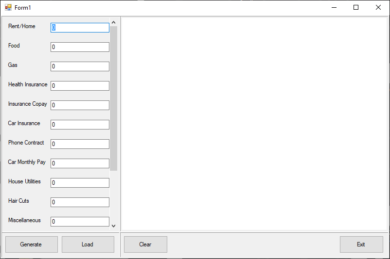
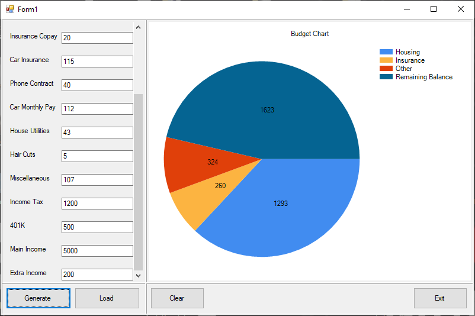
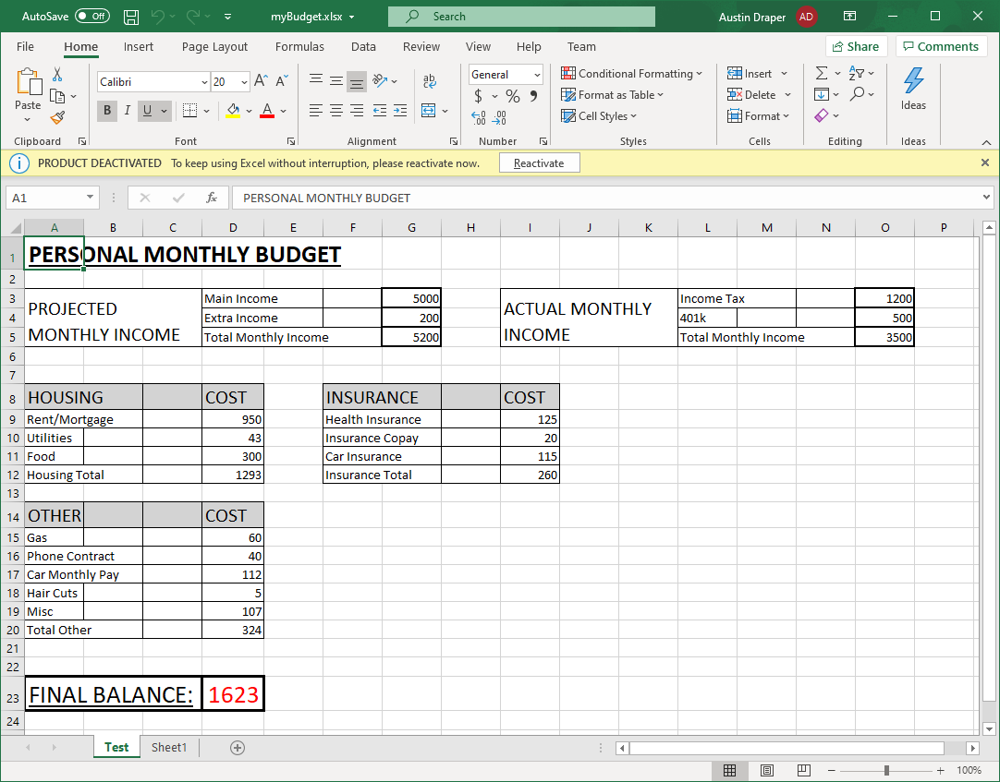

# BudgetApplication
A desktop application designed to help with your monthly budget.
The program compiles user input data to create both a pie chart and an excel file to display your monthly budget.
This is a program utilizing C#, .NET, and Excel.
##
## Running the Program
At launch, the user will start in the home screen.
The home screen is a list of information which are all pre-set to zero.

##
Fill out the data and press the "Generate" button.
A pie chart appears displaying how much money was spent on specific categories.

##
The user can press the clear button at any time to zero out all of the data (including the graph).
An excel file named "myBudget" will be saved to the users desktop.
An example of what an excel file will look like is shown below

##
The application is also capable of editing this data at any point.
Simply press the "Load" button and select a valid excel document that this program has saved in the past.
The program will take all of the information from the excel document and use it to fill the textboxes with the correct values.
Loading will also generate a pie chart for that data.
The user can edit any of these values and save over the excel document.
